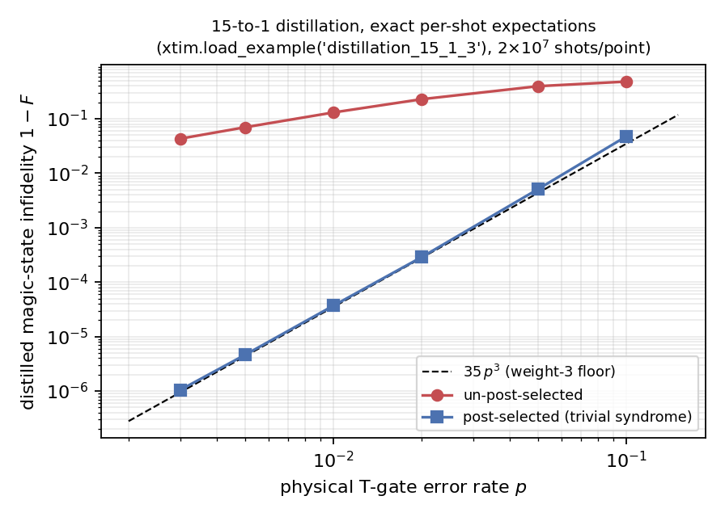

# xtim

[](https://arxiv.org/abs/2512.23799)
[](../../releases)
[](LICENSE)

**[Stim](https://github.com/quantumlib/Stim) can't simulate the `T`/`CS`/`CCZ`/`CH`
gates that make a magic state. xtim can — exactly.**

xtim is a Stim-shaped simulator for **logical magic-state-preparation protocols**
(cultivation, distillation, injection, code switching). It reads a strict superset
of the Stim circuit language, returns the usual Stim-style outputs (measurement
bits, detection events, detector error models, `01`/`b8` formats), and adds the
one output Stim cannot produce: the **exact per-shot expectation values of the
prepared magic state**, under circuit-level noise. It implements Surti, Daguerre &
Kim, *Efficient simulation of logical magic state preparation protocols*
([arXiv:2512.23799](https://arxiv.org/abs/2512.23799)).

## Install

Download the wheel for your platform from [**Releases**](../../releases)
(macOS Apple Silicon / Windows / Linux, CPython 3.11–3.13, no compiler needed):

```bash
pip install xtim-*.whl            # the wheel you downloaded
pip install "xtim[decode]"        # optional: stim + pymatching for the decoder workflow
```

Or build from source with any C++17 compiler: `pip install .` (that's also the
route on an Intel Mac, which has no prebuilt wheel).

## Sixty seconds

Every protocol starts with `diagnose()` — one noiseless run that reports the facts
you'd otherwise reverse-engineer by hand:

```python
import xtim

c = xtim.load_example("distillation_15_1_3")   # 15-to-1 T-state distillation, bundled
print(c.diagnose())
```

```
reference chi : 2 (cached)
detectors     : 4 total — 4 deterministic, 0 gauge
expectations  : 2 declared PAULI_EXPECTATION column(s)
  target (signed beta): [+0.707107, +0.707107]
suggested post-selection (advisory; not applied):
  keep = ~dets[:, [0, 1, 2, 3]].any(axis=1)
```

Then sample, post-select, and score — plain NumPy:

```python
import numpy as np

c = xtim.Circuit(xtim.scale_noise(c.text, 0.01))       # sweep the noise to p = 1e-2
dets, obs, exps = c.compile_detector_sampler(seed=7).sample(
    1_000_000, separate_observables=True, return_expectations=True)

keep = ~dets.any(axis=1)                       # trivial-syndrome post-selection
target = np.array([0.70710678, 0.70710678])    # from diagnose()
F = (1 + (target * exps[keep].mean(axis=0)).sum()) / 2
print(f"accepted {keep.mean():.1%};  distilled 1-F = {1-F:.1e}")
# accepted 86.0%;  distilled 1-F = 4.5e-05     <- the ~35 p^3 distillation floor, exactly
```

That's the whole loop. Sweeping it over `p` reproduces the textbook curve —
per-shot expectations are exact, so the post-selected infidelity is resolved
down to 10⁻⁶ with no logical-failure counting:



For a plot-ready 1−F vs p curve in four lines (`xtim.Task` + `xtim.collect`,
with correlation-aware error bars), and the scoring pitfalls worth knowing
before you trust a fidelity, see [`docs/xtim_scoring.md`](docs/xtim_scoring.md).

## Fast sampling quick-start

The fast pattern is **compile once, sample many times** — the sampler keeps its
compiled plan caches across calls, and reseeding is done in place (~µs), so the
only per-call cost is the sampling itself:

```python
import xtim

c = xtim.load_example("cultivation_d5")
sampler = xtim.compile_twirl_sampler(c.text, skip_refused_observables=True)

for seed in range(100):                 # e.g. one seed per Monte-Carlo batch
    dets, obs = sampler.sample(200_000, seed=seed)
    ...                                 # decode / post-select / score
```

The **first** `sample()` call on a fresh sampler runs a one-time self-check: a
diagnostic oracle window (default `selfcheck=2000`) re-derives the first 2000
fired shots through the full sigma path and verifies them exactly, announced by
a one-line stderr notice. It runs once per sampler lifetime, costs tens of
milliseconds, and is stream-neutral — sampled bytes are identical with it on or
off. Every later call runs the fast path (~0.7 µs/shot warm on cultivation d5).
Pass `selfcheck=0` to skip the window entirely, or set `XTIM_QUIET=1` to
silence the notice.

## xtim or Stim?

| you want | use |
|---|---|
| Pure-Clifford memory experiments, threshold sweeps | **Stim** — per-shot it's ~1.3–3× faster, and it compiles in milliseconds where xtim's reference compile takes ~1 s (d=7) to ~9 s (d=11), once per circuit shape |
| The exact ⟨P̄⟩ of a prepared magic state, shot by shot, under noise | **xtim** — Stim has no such output |
| A decoder in the loop on a magic-state protocol | **xtim** — an honest DEM plus a flagged reject region for the faults a Pauli decoder can't correct |
| Non-Clifford circuits beyond one commuting π/8 layer | neither — see [the simulable class](docs/xtim_simulable_class.md) |

xtim simulates any circuit whose non-Clifford gates fold (through the intervening
Cliffords) into **one mutually-commuting layer of π/8 rotations** — "generalized
T-depth 1". T-count doesn't matter (15-to-1's fifteen `T`s fold to rank 1), the
folded rank χ is a cost knob rather than a limit, and nothing else is ever
rejected. The class includes the diagonal gates `T`/`CS`/`CCZ` and — new in 2.1 —
the **controlled-Hadamard**, which makes H-eigenstate cultivation (measuring the
logical Hadamard) simulable end to end.

## Learn more

| | |
|---|---|
| **New to magic states or xtim** | [`examples/xtim_tutorial.ipynb`](examples/xtim_tutorial.ipynb) — builds up from a single `T` gate |
| **The full workflow** — decode, post-select, score | [`docs/xtim_tour.md`](docs/xtim_tour.md) — executed verbatim by the test suite |
| **"Can xtim simulate my circuit?"** | [`docs/xtim_simulable_class.md`](docs/xtim_simulable_class.md) |
| **Scoring a state, and its pitfalls** | [`docs/xtim_scoring.md`](docs/xtim_scoring.md) |
| **The circuit language** — Stim superset + `T`/`CS`/`CCZ`/`CH` + `PAULI_EXPECTATION` | [`docs/xtim_dialect.md`](docs/xtim_dialect.md) |
| **Decoder DEMs with a reject region** | [`docs/xtim_dem_reject.md`](docs/xtim_dem_reject.md) |
| **Bundled protocols & throughput** (≈10 M shots/s on the small circuits) | [`examples/README.md`](examples/README.md) |
| **CLI, caching, seeding, practical notes** | [`docs/xtim_practical_notes.md`](docs/xtim_practical_notes.md) |
| **Everything, routed by task** | [`docs/README.md`](docs/README.md) |

## Support expectations

xtim is **research software**, maintained on a best-effort basis alongside the
research it supports:

- The `v2.x` API is stable and will be maintained until `v3.0` (which will
  simplify the API; see [CHANGELOG.md](CHANGELOG.md)).
- Supported platform: CPython 3.11–3.13 on Linux, macOS (Apple Silicon), and
  Windows via the released wheels; anything with a C++17 compiler from source.
- Bug reports with a minimal reproducing circuit are welcome as GitHub issues
  and get priority; feature requests and questions are read but answered as
  time permits — there is no support SLA.
- The decoder-orchestration layer built on top of xtim lives in a separate
  research repository and is out of scope here.

## Development

```bash
pip install -e ".[dev]"     # editable install + pytest, stim, pymatching
pytest tests/               # API-contract + exact-physics tests; executes the tour
```

Release notes are in [CHANGELOG.md](CHANGELOG.md). License:
[Apache-2.0](LICENSE). To cite xtim, see [CITATION.cff](CITATION.cff).
